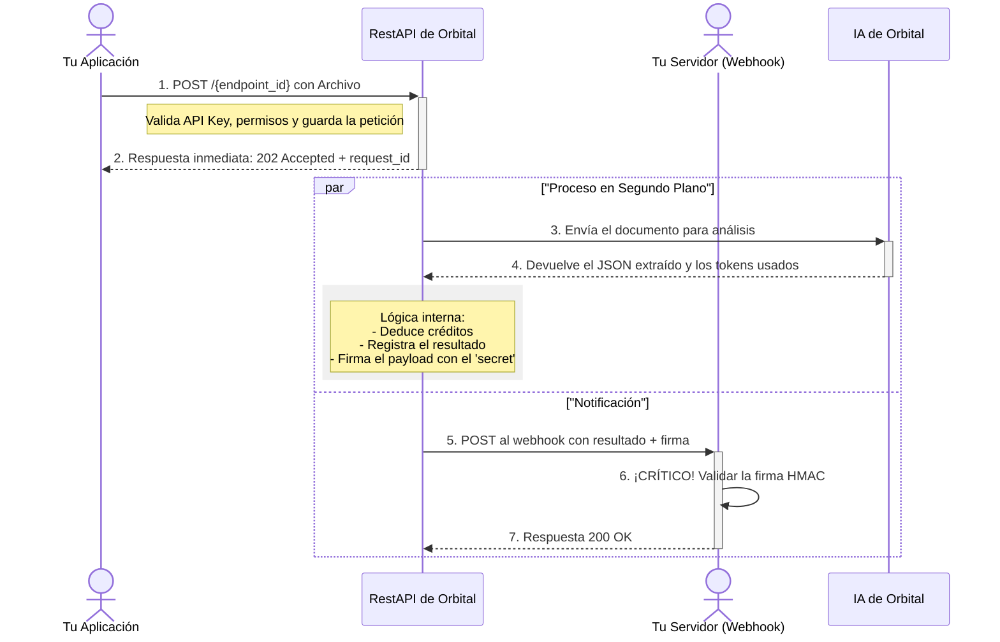

# Documentación de la API de Orbital v2.0.0

Bienvenido a la documentación oficial de la API de `Orbital`. Esta guía te proporcionará todo lo que necesitas para integrar nuestra potente solución de procesamiento de documentos en tu aplicación.

---

## 0. Quick Start (5 minutos)

1.  **Crea tu API Key**: Se usará para autenticar tus peticiones.
2.  **Define tu Endpoint**: Configura una URL en tu sistema donde recibirás los resultados (`webhook`), un `schema` para la extracción de datos, y un `secret` para asegurar la comunicación.
3.  **Envía un archivo**: Realiza una petición `POST` a nuestro endpoint de procesamiento con el archivo y tu `endpoint_id`. Recibirás un `request_id`.
4.  **Verifica y recibe el resultado**: Tu webhook recibirá una petición `POST` con una firma de seguridad y el JSON extraído, junto al `request_id` para que puedas asociarlo.

### Ejemplo Mínimo (cURL)

```bash
# Reemplaza estos valores con los tuyos
API_KEY="6e00bf49-e573-45ce-a691-aad0ba1686ed"
CV_FILE_PATH="ubicacion/donde/guardes/arcivo.pdf" # tanto pdf, imagen, docx...
ENDPOINT_ID="697888ca-9aa1-4c2c-8bd4-423769769f70"
API_URL="https://orbial.com" # URL base de la API

curl -X POST "${API_URL}/${ENDPOINT_ID}" \
     -H "Authorization: Bearer ${API_KEY}" \
     -F "file=@${FILE_PATH}"
```

Recibirás una respuesta `202 Accepted` como esta:

```json
{
  "message": "Archivo recibido. El procesamiento ha comenzado.",
  "request_id": "b1b2f345-6789-0123-abcd-efgh45678901"
}
```

> **Regla Clave**: Una respuesta `202 Accepted` solo confirma la recepción. El resultado final del procesamiento siempre se comunica a través del webhook.

---

## 1. Conceptos Clave

-   **API Key**: Tu clave secreta para autenticarte. Se envía en el header `Authorization: Bearer <tu_api_key>`.
-   **Endpoint**: Una configuración en tu cuenta que asocia una URL de **webhook**, un **esquema JSON** de datos y un **secreto de webhook**. Se le asigna un `endpoint_id` único para identificarlo en las peticiones.
-   **Webhook**: Una URL en tu servidor a la que `Orbital` enviará los resultados del procesamiento.
-   **Secreto de Webhook**: Una clave secreta que tú defines. Se usa para generar una firma digital (`HMAC-SHA256`) y así puedas verificar que los webhooks que recibes son auténticos.
-   **Request ID**: Un identificador único (`UUID`) que se genera para cada archivo que envías. Es crucial para correlacionar la petición inicial con el resultado final.
-   **Modo de Análisis**: Configuración que define cómo se procesará el documento (`vision_only` o `vision_first`).

---

## 2. Arquitectura y Funcionamiento

La API de `Orbital` está diseñada para ser **totalmente asíncrona**, lo que nos permite procesar documentos complejos sin que tu aplicación tenga que esperar una respuesta. El flujo de trabajo se divide en dos fases principales: una petición síncrona inicial y un proceso asíncrono en segundo plano que culmina con una llamada a tu webhook.

El siguiente diagrama de secuencia ilustra la interacción entre tu aplicación, los componentes de Orbital y tu servidor.



---

## 3. Endpoints de la API

### 3.1. Procesar un Documento

-   `POST /{endpoint_id}`

Este es el endpoint principal para enviar documentos.

**Parámetros de la URL:**
-   `endpoint_id` (UUID, obligatorio): El identificador de tu configuración de endpoint.

**Headers:**
-   `Authorization` (string, obligatorio): `Bearer <tu_api_key>`.
-   `Content-Type` (string, obligatorio): `multipart/form-data`.

**Cuerpo (form-data):**
-   `file` (archivo, obligatorio): El documento a procesar (`.pdf`, `.docx`, `.png`, `.jpg`).

---

## 4. Definición del Esquema de Salida (JSON)

El esquema de salida es el corazón de `Orbital`. Es un objeto JSON que tú defines y que le sirve como plantilla a la IA para saber qué información extraer y cómo estructurarla.

### 4.1. ¿Para qué sirve el esquema?

-   **Define la estructura**: Le dices a la IA exactamente qué campos quieres (ej. `nombre`, `experiencia_laboral`, `habilidades`).
-   **Guía a la IA**: Actúa como un conjunto de instrucciones precisas, asegurando que la IA busque la información relevante para ti.
-   **Garantiza consistencia**: Asegura que cada webhook que recibas tenga una estructura JSON predecible, facilitando su procesamiento en tu backend.

**Ejemplo de un esquema para un CV:**

Al configurar tu endpoint, proporcionarías un JSON como este:

```json
{
  "nombre_completo": "string",
  "informacion_de_contacto": {
    "email": "string",
    "telefono": "string",
    "linkedin": "string"
  },
  "resumen_profesional": "string",
  "experiencia": [
    {
      "puesto": "string",
      "empresa": "string",
      "periodo": "string",
      "descripcion": "string"
    }
  ],
  "habilidades_tecnicas": ["string"]
}
```

### 4.2. La importancia de los campos `null`

Una regla fundamental de la IA de `Orbital` es la consistencia estructural.

-   **Si la IA no encuentra información** para un campo específico en el documento, **no omitirá el campo**. En su lugar, le asignará un valor `null`.
-   Si un campo es una lista (como `experiencia` o `habilidades_tecnicas`) y no se encuentra ningún elemento, la IA devolverá una lista vacía `[]`.

Esto significa que siempre puedes contar con que el `data` de tu webhook contendrá todas las claves definidas en tu esquema, evitando errores de `KeyError` o `property does not exist` en tu código.

**Ejemplo de respuesta para un CV con poca información:**

```json
{
  "status": "completed",
  "data": {
    "nombre_completo": "Ana Torres",
    "informacion_de_contacto": {
      "email": "ana.t@example.com",
      "telefono": null,
      "linkedin": null
    },
    "resumen_profesional": "Estudiante de ingeniería de software.",
    "experiencia": [],
    "habilidades_tecnicas": ["Python", "Java"]
  },
  "usage": {
      "prompt_tokens": 480,
      "completion_tokens": 120,
      "total_tokens": 600
  }
}
```

### 4.3 Asistente con IA de orbital para JSON

ya tu sabe papi pue klk la ia lo ase

---

## 5. Recibiendo Datos con Webhooks

### 5.1. Consumo de Créditos

El coste de cada procesamiento se basa en el número total de *tokens* utilizados por la IA.
-   Tras un procesamiento exitoso, los créditos correspondientes al `total_tokens` del `usage` se deducen de tu cuenta.
-   Si no tienes créditos suficientes en el momento de la deducción, el procesamiento se marcará como fallido con un error de `InsufficientCreditsError`, aunque el análisis de `Orbital` haya sido exitoso.

### 5.2. Estructura del Payload (Respuesta)

Tu endpoint de webhook recibirá un `POST` con el resultado.

**Payload de Éxito (`status: "completed"`):**
```json
{
  "status": "completed",
  "data": { ... }, // Objeto con la información extraída según tu schema
  "usage": {
    "prompt_tokens": 512,
    "completion_tokens": 256,
    "total_tokens": 768
  }
}
```

**Payload de Error (`status: "failed"`):**
```json
{
  "status": "failed",
  "error": "Créditos insuficientes. Se requieren 768 créditos para esta operación.",
  "data": null
}
```

### 5.3. Ejemplo de un Receptor de Webhook Simple

Puedes empezar con un receptor de webhook muy simple para verificar que estás recibiendo los datos.

**Nota:** Este ejemplo es para fines de desarrollo y depuración. Para producción, **debes implementar la verificación de firma HMAC** como se describe en la siguiente sección.

```javascript
import express from 'express';

const app = express();
// Usamos el middleware de JSON para parsear automáticamente el cuerpo de la petición.
app.use(express.json());

app.post('/webhook-receiver', (req, res) => {
  const payload = req.body;

  console.log('¡Webhook recibido!');
  
  // Asumiendo que el request_id viene en el payload. Ajusta según la estructura final.
  // console.log('Request ID:', payload.request_id); 

  if (payload.status === 'completed') {
    // Lógica para un procesamiento exitoso:
    console.log('Datos extraídos:', payload.data);
  } else {
    // Lógica para un procesamiento fallido:
    console.error('Fallo en el procesamiento:', payload.error);
  }

  // ¡Importante! Responde con un 200 OK para que Orbital sepa que recibiste el webhook.
  res.status(200).send('OK');
});

const PORT = 3000;
app.listen(PORT, () => console.log(`Servidor de webhooks escuchando en el puerto ${PORT}`));
```

### 5.4. Seguridad: Verificación de Firma HMAC

**Esta es una característica de seguridad crítica.** Cada webhook que enviamos incluye una firma `HMAC-SHA256` en el header `X-Hub-Signature-256`. Debes verificar esta firma para asegurarte de que el webhook proviene de Orbital y no ha sido alterado.

**Header:**
-   `X-Hub-Signature-256`: `sha256=<hash_hmac_sha256>`

**Pasos para la verificación:**
1.  Obtén el `secret_webhook` que configuraste para tu endpoint.
2.  Calcula el `HMAC-SHA256` del cuerpo **exacto** del webhook (`raw request body`) usando tu secreto como clave.
3.  Compara el hash que calculaste con el que viene en el header `X-Hub-Signature-256`. Si coinciden, el webhook es válido.

#### Ejemplo de Verificación en Node.js (Express)
```javascript
import express from 'express';
import crypto from 'crypto';

const app = express();
// ¡MUY IMPORTANTE! Usa express.raw() para poder verificar la firma.
// express.json() modificaría el cuerpo y la firma no coincidiría.
app.use(express.raw({ type: 'application/json' }));

const WEBHOOK_SECRET = process.env.ORBITAL_WEBHOOK_SECRET;

app.post('/webhook-receiver', (req, res) => {
  const signature = req.get('X-Hub-Signature-256');
  if (!signature) {
    return res.status(400).send('No signature provided');
  }

  const hmac = crypto.createHmac('sha256', WEBHOOK_SECRET);
  const digest = `sha256=${hmac.update(req.body).digest('hex')}`;

  if (!crypto.timingSafeEqual(Buffer.from(digest), Buffer.from(signature))) {
    return res.status(401).send('Invalid signature');
  }

  // Ahora que la firma es válida, puedes parsear el cuerpo
  const payload = JSON.parse(req.body);

  console.log('Webhook verificado y recibido:');
  // ... tu lógica para procesar el payload ...

  res.status(200).send('OK');
});
```

### 5.5. Reintentos y Timeouts

-   Si tu endpoint no responde con un código `2xx` en **30 segundos**, consideraremos la entrega como fallida.
-   El sistema reintentará la entrega hasta **3 veces** con un retardo creciente entre intentos.

---

## 6. Gestión de Errores

### 6.1. Errores Síncronos (Respuesta al `POST` inicial)

Estos errores ocurren inmediatamente al hacer la petición.

| Código | `detail` | Motivo |
|---|---|---|
| `401 Unauthorized` | `API Key inválida o no proporcionada.` / `No se proporcionó una API Key válida en el formato 'Bearer <key>'.` | El header `Authorization` es incorrecto o la clave no es válida. |
| `402 Payment Required` | `Créditos insuficientes. Se requieren X créditos...` | No tienes créditos para iniciar la operación (esto es un chequeo preliminar, el débito final ocurre después). |
| `403 Forbidden` | `No tienes permiso para usar este endpoint.` | La API Key es válida, pero no está asociada al `endpoint_id` solicitado. |
| `404 Not Found` | `Endpoint con id '...' no encontrado.` | El `endpoint_id` en la URL no existe. |
| `422 Unprocessable Entity`| (Error de FastAPI) | El archivo no se adjuntó correctamente en el campo `file` del `multipart/form-data`. |

### 6.2. Errores Asíncronos (En el payload del webhook)

Estos errores se reportan en el campo `error` del webhook.

| `error` (mensaje)                                                                                 | Causa probable                                                                                                                 |
| ------------------------------------------------------------------------------------------------- | ------------------------------------------------------------------------------------------------------------------------------ |
| `Créditos insuficientes. Se requieren X créditos para esta operación.`                            | El análisis se completó, pero no tenías suficientes créditos para cubrir el coste final.                                       |
| `El esquema de salida (output_schema) es obligatorio.`                                            | Error de configuración en tu endpoint. No se definió un `schema`.                                                              |
| `Tipo de archivo no soportado para análisis manual: ...`                                          | Ocurrió un fallo en el modo `vision` y el tipo de archivo no es soportado por el fallback a texto (ej. no es PDF/DOCX/imagen). |
| `No se pudo extraer texto del archivo para el análisis manual.`                                   | El archivo parece válido, pero las herramientas de extracción de texto no encontraron contenido.                               |
| `Error en el servicio de análisis de IA.` / `Error en la llamada a la API del proveedor de IA...` | Un problema temporal o inesperado con el proveedor de IA.                                                                      |
| `Error interno en la base de datos.` / `Error al procesar el archivo.`                            | Un error interno en nuestra plataforma.                                                                                        |

---

## 7. Debugging y Logs

El sistema registra información detallada sobre cada paso del proceso, lo cual es invaluable para la depuración.

-   **Archivo de Log**: Todos los eventos se registran en `logs/app.log` dentro del entorno de la API.
-   **Base de Datos de Logs**:
    -   `requests`: Cada petición `POST` inicial crea un registro en esta tabla. Puedes seguir el ciclo de vida de tu petición a través de su `status` (`processing`, `completed`, `failed`).
    -   `request_logs`: Contiene el `payload_out` final que se envía al webhook, el uso de créditos y cualquier mensaje de error.
    -   `webhooks`: Registra cada intento de envío de un webhook, incluyendo el `http_status` de la respuesta de tu servidor y los errores.

Si contactas a soporte, por favor proporciona el `request_id` para que podamos rastrear el problema rápidamente.
